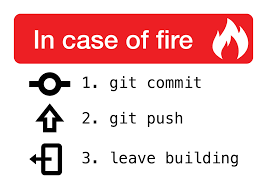

### Hello World 🐱‍💻

#     

I integrate machine learning/numerical algorithms into the drug design
pipeline. More specifically, my research focuses on molecular property prediction, protein allostery prediction, epigenetics, *etc.*. I devoted most of my spare time to open-source software development, such as
[procrustes](https://github.com/theochem/procrustes).
 

💻 Software Engineer at [Ayers Group](https://www.chemistry.mcmaster.ca/ayers/) 
💻 Speaks English, Chinese, Python, LaTex, Markdown 
💻 Publication: *Scientific Data*, *Medicinal Research Reviews*, *Journal of Medicinal Chemistry*,
*Elife*, *etc.*. Total publications=16,
H-index=7. More on [Google Scholar](https://scholar.google.ca/citations?user=5Xk8ab8AAAAJ&hl=en) 

### Programming Skills:            

### Coding Summary:

<!-- 

 -->
